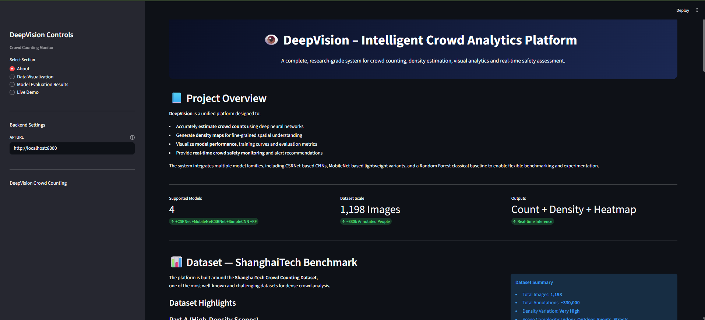
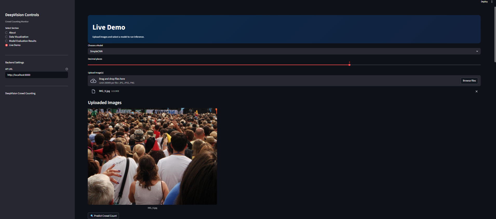
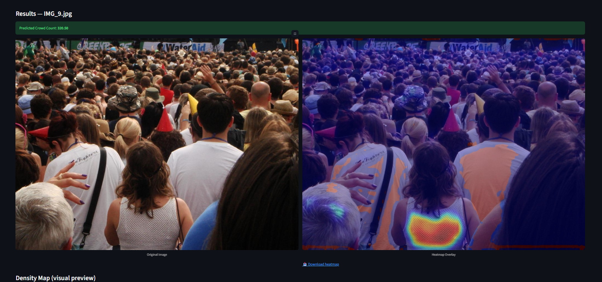

# 🧠🔍 DeepVision Crowd Monitor  
### **AI for Real-Time Crowd Density Estimation & Overcrowding Detection**

DeepVision Crowd Monitor is an AI-powered system designed to estimate crowd density and detect overcrowded zones **in real time** using live surveillance video feeds.  
This project enhances **public safety**, supports **emergency response**, and enables **smart crowd management** in high-footfall environments such as:

- Railway & metro stations  
- Airports  
- Public events and festivals  
- Religious gatherings  
- Stadiums  
- Smart city surveillance systems  

Using deep learning (CSRNet/MCNN) and computer vision, the system generates accurate density maps and triggers alerts when crowd limits are exceeded.

---

## 🚀 Features

### ✅ **AI-Powered Crowd Counting**
- CSRNet / MCNN deep learning models  
- High-precision density map estimation  
- Works on images + real-time video feed  

### ✅ **Overcrowding Detection**
- Automatically detects congestion  
- Triggers alerts based on dynamic thresholds  
- Supports email & SMS alerts (SMTP + Twilio)  

### ✅ **Real-Time Monitoring Dashboard**
- Built with Streamlit  
- Live camera integration  
- Heatmap overlays  
- Model testing interface  
- Inference history tracking  

### ✅ **Deployment Ready**
- Docker support  
- GPU acceleration via CUDA  
- Modular backend (FastAPI)  
- Production-safe project structure  

---


## 🧱 Architecture Overview

**Pipeline:**

Video Feed → Frame Extraction → Preprocessing → Deep Learning Model  
Crowd Count Logic → Overcrowding Detection → Dashboard + Alerts

        ┌────────────────────────┐
        │   Live CCTV / Video    │
        └─────────────┬──────────┘
                      ↓
           ┌────────────────────┐
           │  Frame Extraction  │
           └────────────┬───────┘
                      ↓
           ┌────────────────────┐
           │   Pre-processing   │
           │ (Resize, Normalize)│
           └────────────┬───────┘
                      ↓
         ┌──────────────────────────────────────────┐
         │    Deep Learning Model                   │ 
         │  CSRNet / MCNN / SimpleCNN /RandomForest │
         └──────────────┬───────────────────────────┘  
                       ↓
       ┌─────────────────────────────────┐
       │ Density Map + Crowd Count Logic │
       └──────────────────┬──────────────┘
                         ↓
    ┌──────────────────────────────┐
    │  Overcrowding Detection      │
    │ (Dynamic threshold alerts)   │
    └───────────────┬──────────────┘
                    ↓
     ┌────────────────────────────────┐
     │  Streamlit Dashboard + Alerts  │
     └────────────────────────────────┘

---

## 🏗️ Tech Stack

### **Deep Learning & ML**
- PyTorch 2.5.1 with CUDA 12.1
- CSRNet (VGG16-based encoder-decoder)
- MobileNetCSRNet (Lightweight variant)
- SimpleCNN (Custom architecture)
- RandomForest (Classical ML baseline)

### **Backend & API**
- FastAPI (Model serving)
- Uvicorn (ASGI server)

### **Frontend & Visualization**
- Streamlit (Interactive dashboard)
- Matplotlib & Seaborn (Plotting)
- Pandas (Data handling)
- Pillow (Image processing)

### **Data Processing**
- NumPy & SciPy
- OpenCV (Image operations)
- H5py (Dataset storage)

---

# 📂 Dataset — ShanghaiTech Crowd Counting

The project uses the **ShanghaiTech Dataset**, a benchmark dataset used for density estimation research.

### **Part A**
- Highly dense crowds  
- 482 images (300 train / 182 test)  
- Average ~501 people/image  

### **Part B**
- Low-density, campus-like  
- 716 images (400 train / 316 test)  
- Average ~123 people/image  

Ground-truth consists of head annotations `(x, y)` → converted into Gaussian density maps.

---

## 🗂️ Project Milestones

### **Milestone 1: Setup & Data Preparation (Weeks 1–2)**  
- Install dependencies (PyTorch, OpenCV, etc.)  
- Download and preprocess dataset  
- Build data loader + visualization modules  
- Validate environment setup  

### **Milestone 2: Model Training (Weeks 3–4)**  
- Implement CSRNet/MCNN  
- Train model with dataset  
- Generate density maps  
- Validate using MAE  

### **Milestone 3: Real-Time Integration (Weeks 5–6)**  
- Connect OpenCV to live camera feed  
- Real-time crowd counting  
- Overcrowding detection  
- Trigger alerts  

### **Milestone 4: Dashboard & Deployment (Weeks 7–8)**  
- Real-time dashboard (Flask/Streamlit)  
- Email/SMS alerts (SMTP/Twilio)  
- Docker containerization  
- GPU optimization  
- Deployment documentation  

---

## 🤖 Implemented Models

### **1. CSRNet (Congested Scene Recognition Network)**
- **Architecture**: VGG16 frontend + dilated convolution backend
- **Parameters**: ~16M
- **Performance**: MAE: 109.41, RMSE: 149.92
- **Best Use**: High-accuracy scenarios, acceptable inference time

### **2. MobileNetCSRNet**
- **Architecture**: MobileNetV2 frontend + CSRNet backend
- **Parameters**: ~3M (5x smaller than CSRNet)
- **Performance**: Balanced accuracy and speed
- **Best Use**: Resource-constrained environments, mobile deployment

### **3. SimpleCNN**
- **Architecture**: Custom lightweight encoder-decoder
- **Parameters**: ~2M
- **Performance**: Fast inference with reasonable accuracy
- **Best Use**: Real-time applications, edge devices

### **4. RandomForest Baseline**
- **Type**: Classical ML approach
- **Features**: Hand-crafted image features
- **Best Use**: Baseline comparison, interpretable predictions

---

## 🧪 How to Run the Project

### **1. Clone the Repository**
```
git clone https://github.com/springboardmentor0509-source/deepVision_crowd_monitor.git
cd deepVision_crowd_monitor
```

### **2. Create a Virtual Environment**
### **Windows (CMD / PowerShell)**
```
python -m venv venv
venv\Scripts\activate
```

### **Mac/ Linux**
```
python3 -m venv venv
source venv/bin/activate

```

### **3. Install Dependencies**
```
pip install -r requirements.txt
```


### **4.Setup Dataset**
Download the ShanghaiTech dataset and place it in `Dataset/ShanghaiTech/`
```
dataset/
 └── ShanghaiTech/
      ├── part_A/
      └── part_B/
```

### **5. Preprocess Data** (Optional - if training from scratch)
```
python preprocessing/run_preprocess.py
```

### **6. Train Models** (Optional - pre-trained models available)
```
# CSRNet
python run_csrnet.py

# MobileNetCSRNet
python run_mobile_csrnet.py

# SimpleCNN
python run_simple_cnn.py

# RandomForest
python run_random_forest.py
```

### **7. Run Backend**
```
uvicorn backend.main:app --reload --port 8000
# Backend runs on http://localhost:8000
```

### **8. Launch Dashboard**
```
cd frontend
streamlit run app.py
# Dashboard opens at http://localhost:8501
```
---

## 📸 Project Screenshots

### Dashboard Overview

*A complete, research-grade system for crowd counting, density estimation, visual analytics and real-time safety assessment.*

---

### 📊 Data Visualization & Analysis

*Explore plots, charts and images produced during preprocessing, training and evaluation.*


---

### ⭐ Model Evaluation Results

*Best model performance metrics displayed in an intuitive dashboard format.*

### Live Demo




---


## 🛡️ Use Cases

- Crowd safety monitoring  
- Smart city surveillance  
- Event management  
- Railway/Metro stations  
- Emergency evacuation assistance  

---

## 🔮 Future Enhancements


- **Video Stream Processing**: Real-time analysis of live camera feeds
- **Multi-camera Fusion**: Aggregate data from multiple cameras for comprehensive monitoring
- **Predictive Analytics**: Forecast crowd density patterns based on historical data
- **Mobile App**: iOS/Android app for on-the-go monitoring
- **IoT Integration**: Connect with smart sensors and emergency systems
- **Cloud Deployment**: AWS/Azure/GCP scalable infrastructure

---

