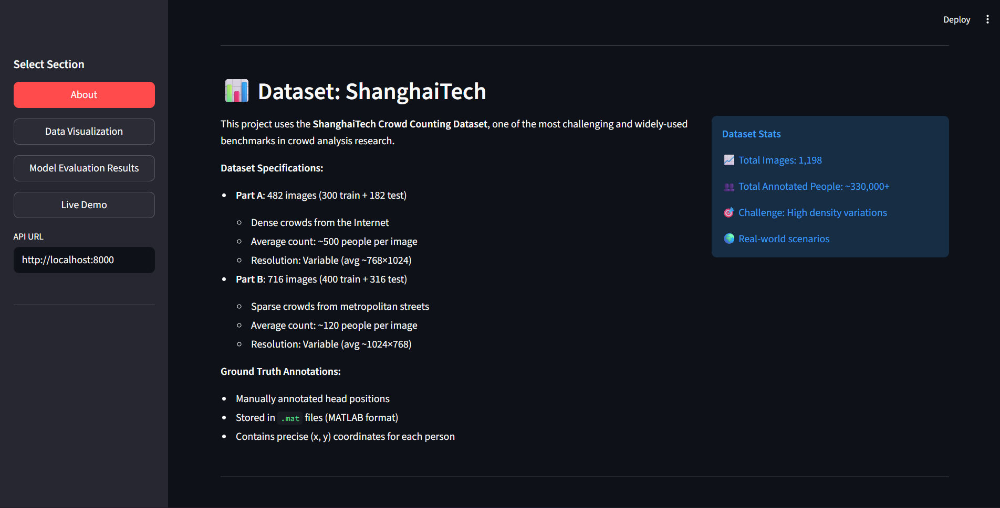
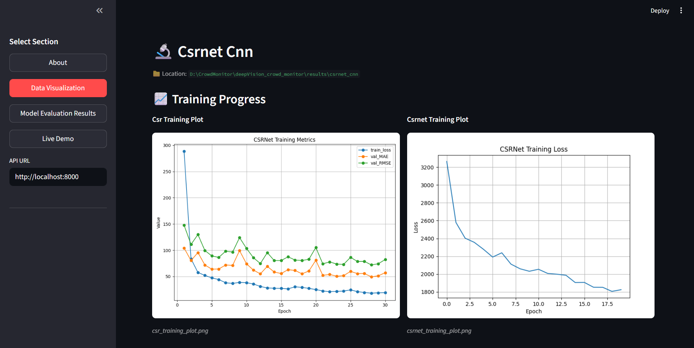
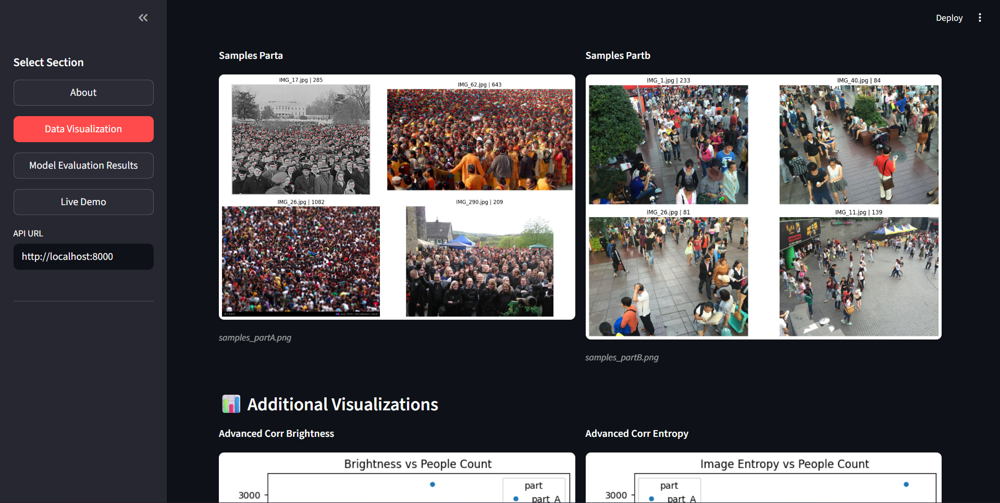
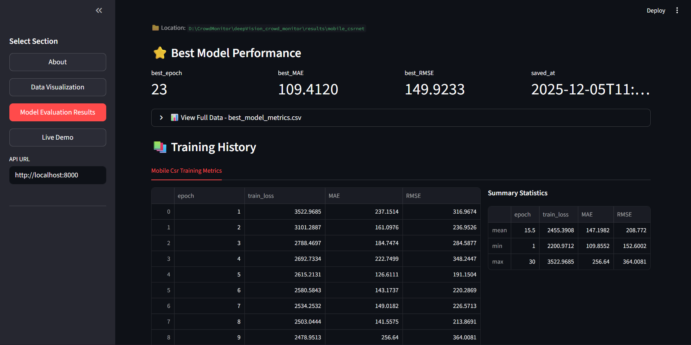
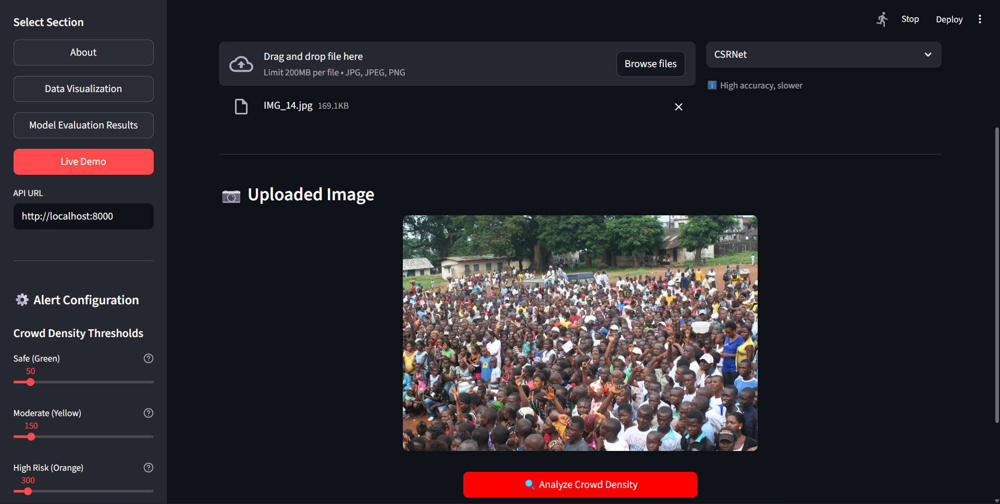
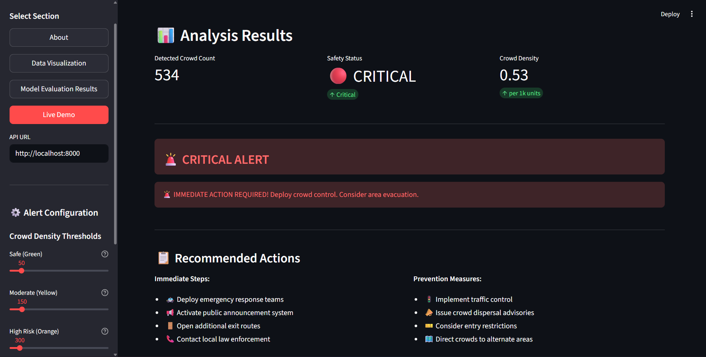

# 🧠🔍 DeepVision Crowd Monitor  
### **AI for Real-Time Crowd Density Estimation & Overcrowding Detection**

DeepVision Crowd Monitor is an AI-powered system designed to estimate crowd density and detect overcrowded zones **in real time** using live surveillance video feeds.  
This project enhances **public safety**, supports **emergency response**, and enables **smart crowd management** in high-footfall environments such as:

- Railway & metro stations  
- Airports  
- Public events and festivals  
- Religious gatherings  
- Stadiums  
- Smart city surveillance systems  

Using deep learning (CSRNet/MCNN) and computer vision, the system generates accurate density maps and triggers alerts when crowd limits are exceeded.

---

## 🚀 Key Features

- **Multiple Model Support**: CSRNet, MobileNetCSRNet, SimpleCNN, and RandomForest baseline
- **Real-time Crowd Analysis**: Deep learning-based density estimation with AI-powered inference
- **Safety Alert System**: 4-tier classification (Safe/Moderate/High/Critical) with actionable recommendations
- **Interactive Dashboard**: Streamlit-based web interface with auto-display visualizations
- **Density Heatmaps**: Color-coded overlays showing crowd concentration zones
- **Model Performance Tracking**: Comprehensive metrics display with training history
- **Configurable Thresholds**: Customizable alert levels for different venue capacities
- **GPU-Accelerated Training**: PyTorch with CUDA support for efficient model training
- **FastAPI Backend**: RESTful API for model serving and predictions  

---

## 🧱 Architecture Overview

**Pipeline:**

Video Feed → Frame Extraction → Preprocessing → Deep Learning Model  
Crowd Count Logic → Overcrowding Detection → Dashboard + Alerts

---

## 🏗️ Tech Stack

### **Deep Learning & ML**
- PyTorch 2.5.1 with CUDA 12.1
- CSRNet (VGG16-based encoder-decoder)
- MobileNetCSRNet (Lightweight variant)
- SimpleCNN (Custom architecture)
- RandomForest (Classical ML baseline)

### **Backend & API**
- FastAPI (Model serving)
- Uvicorn (ASGI server)

### **Frontend & Visualization**
- Streamlit (Interactive dashboard)
- Matplotlib & Seaborn (Plotting)
- Pandas (Data handling)
- Pillow (Image processing)

### **Data Processing**
- NumPy & SciPy
- OpenCV (Image operations)
- H5py (Dataset storage)
- MATLAB format support (.mat files)  

---

## 📂 Dataset

**ShanghaiTech Crowd Counting Dataset**  
- **Total Images**: 1,198 annotated images with 330,000+ people
- **Part A**: 482 images (300 train + 182 test) - Dense crowds (~500 people/image)
- **Part B**: 716 images (400 train + 316 test) - Sparse crowds (~120 people/image)
- **Annotations**: Ground-truth head positions in .mat format
- **Density Maps**: Geometry-adaptive Gaussian kernels for accurate crowd representation

---

## 🤖 Implemented Models

### **1. CSRNet (Congested Scene Recognition Network)**
- **Architecture**: VGG16 frontend + dilated convolution backend
- **Parameters**: ~16M
- **Performance**: MAE: 109.41, RMSE: 149.92
- **Best Use**: High-accuracy scenarios, acceptable inference time

### **2. MobileNetCSRNet**
- **Architecture**: MobileNetV2 frontend + CSRNet backend
- **Parameters**: ~3M (5x smaller than CSRNet)
- **Performance**: Balanced accuracy and speed
- **Best Use**: Resource-constrained environments, mobile deployment

### **3. SimpleCNN**
- **Architecture**: Custom lightweight encoder-decoder
- **Parameters**: ~2M
- **Performance**: Fast inference with reasonable accuracy
- **Best Use**: Real-time applications, edge devices

### **4. RandomForest Baseline**
- **Type**: Classical ML approach
- **Features**: Hand-crafted image features
- **Best Use**: Baseline comparison, interpretable predictions

---
<!-- 
## 🗂️ Project Milestones

### **Milestone 1: Setup & Data Preparation (Weeks 1–2)**  
- Install dependencies (PyTorch, OpenCV, etc.)  
- Download and preprocess dataset  
- Build data loader + visualization modules  
- Validate environment setup  

### **Milestone 2: Model Training (Weeks 3–4)**  
- Implement CSRNet/MCNN  
- Train model with dataset  
- Generate density maps  
- Validate using MAE  

### **Milestone 3: Real-Time Integration (Weeks 5–6)**  
- Connect OpenCV to live camera feed  
- Real-time crowd counting  
- Overcrowding detection  
- Trigger alerts  

### **Milestone 4: Dashboard & Deployment (Weeks 7–8)**  
- Real-time dashboard (Flask/Streamlit)  
- Email/SMS alerts (SMTP/Twilio)  
- Docker containerization  
- GPU optimization  
- Deployment documentation  

--- -->

## 🧪 How to Run the Project

### **Prerequisites**
- Python 3.11+
- CUDA 12.1+ (for GPU acceleration)
- PyTorch 2.5.1+

### **1. Clone the Repository**
```bash
git clone https://github.com/springboardmentor0509-source/deepVision_crowd_monitor.git
cd deepVision_crowd_monitor
```

### **2. Create Virtual Environment**
```bash
python -m venv venv311
# Windows
venv311\Scripts\activate
# Linux/Mac
source venv311/bin/activate
```

### **3. Install Dependencies**
```bash
pip install -r requirements.txt
```

### **4. Download Dataset**
Download the ShanghaiTech dataset and place it in `Dataset/ShanghaiTech/`

### **5. Preprocess Data** (Optional - if training from scratch)
```bash
python preprocessing/run_preprocess.py
```

### **6. Train Models** (Optional - pre-trained models available)
```bash
# CSRNet
python run_csrnet.py

# MobileNetCSRNet
python run_mobile_csrnet.py

# SimpleCNN
python run_simple_cnn.py

# RandomForest
python run_random_forest.py
```

### **7. Start FastAPI Backend**
```bash
python start_backend.py
# Backend runs on http://localhost:8000
```

### **8. Launch Streamlit Dashboard**
```bash
streamlit run output.py
# Dashboard opens at http://localhost:8501
```

---

## 📸 Project Screenshots

### 🏠 Dashboard Overview

*Comprehensive project overview with dataset specifications, showing ShanghaiTech Crowd Counting Dataset details including 1,198 total images and 330,000+ annotated people across Part A (dense crowds) and Part B (sparse crowds).*

---

### 📊 Data Visualization & Analysis

#### Training Performance

*CSRNet model training metrics visualization showing loss convergence, MAE (Mean Absolute Error), and RMSE (Root Mean Square Error) across 30 epochs. Training plots demonstrate model learning progression with validation metrics.*

#### Dataset Samples

*Sample images from ShanghaiTech Dataset Part A (high-density crowds averaging ~500 people) and Part B (sparse metropolitan crowds averaging ~120 people), showcasing the diverse crowd scenarios used for model training.*

#### Advanced Visualizations

*Advanced correlation analysis including Brightness vs People Count and Image Entropy vs People Count, providing insights into dataset characteristics and model behavior patterns.*

---

### ⭐ Model Evaluation Results

*Best model performance metrics displayed in an intuitive dashboard format. Shows key performance indicators including best epoch (23), MAE (109.41), RMSE (149.92), and complete training history with summary statistics for comprehensive model assessment.*

---

### 🚨 Live Crowd Monitoring & Safety Alert System

#### Image Upload & Configuration

*Real-time crowd monitoring interface with drag-and-drop image upload, model selection (CSRNet/MobileNetCSRNet/SimpleCNN/RandomForest), and configurable alert thresholds for Safe (Green), Moderate (Yellow), High Risk (Orange), and Critical (Red) crowd density levels.*

#### Safety Alert & Actionable Recommendations

*Live safety assessment showing CRITICAL alert status for detected crowd count of 534 people with density of 0.53 per 1k units. System provides immediate action steps (deploy emergency response, activate announcements, open exit routes) and prevention measures (traffic control, crowd dispersal advisories) for authorities.*

#### Crowd Density Heatmap Visualization

*AI-generated crowd density heatmap overlay with color-coded visualization where red/yellow areas indicate higher concentration zones. Includes download functionality for analysis reports and technical details access for transparency.*

---

## 🛡️ Use Cases

- **Public Safety**: Real-time monitoring of crowded venues with automated alerts
- **Event Management**: Capacity monitoring for concerts, festivals, and sports events
- **Transportation Hubs**: Railway stations, metro stations, and airports crowd management
- **Religious Gatherings**: Managing large crowds at temples, mosques, churches
- **Smart Cities**: Integration with city surveillance for emergency response
- **Retail Analytics**: Customer flow analysis in shopping malls
- **Campus Security**: University and school crowd monitoring

---

## 🔮 Future Enhancements

- **Video Stream Processing**: Real-time analysis of live camera feeds
- **Multi-camera Fusion**: Aggregate data from multiple cameras for comprehensive monitoring
- **Predictive Analytics**: Forecast crowd density patterns based on historical data
- **Mobile App**: iOS/Android app for on-the-go monitoring
- **IoT Integration**: Connect with smart sensors and emergency systems
- **Model Optimization**: Quantization and pruning for edge deployment
- **Cloud Deployment**: AWS/Azure/GCP scalable infrastructure
- **Historical Tracking**: Database integration for long-term crowd pattern analysis

---

## 📄 License

This project is developed for educational and research purposes.


